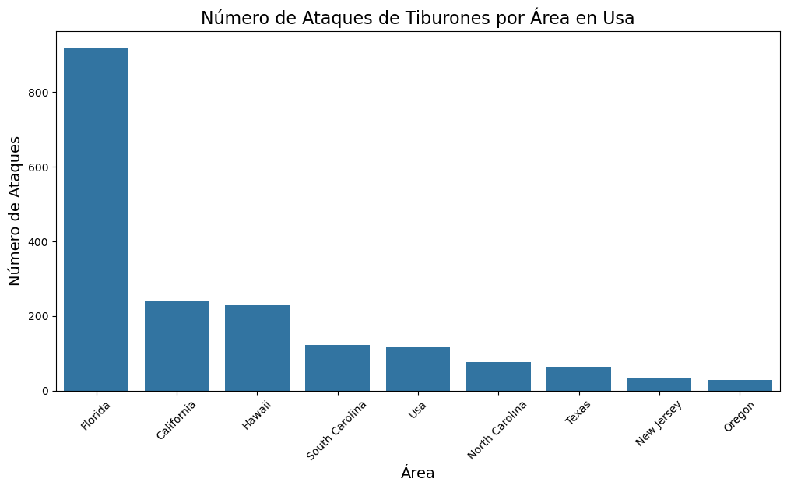
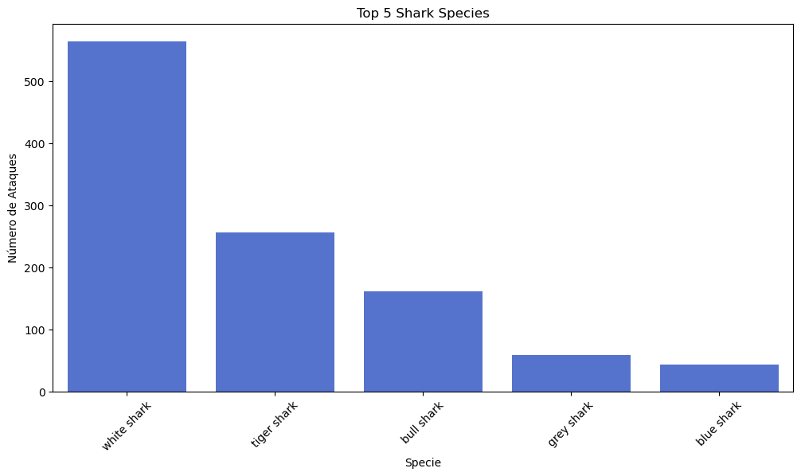

# Shark Attacks
A continuación podemos definir los objetivos de este primer proyecto como:
#### 1. Limpiar y analizar los datos
#### 2. Identificar patrones y crear las primeras hipotesis
#### 3. Extraer conclusiones

## 1. Limpieza y análisis de los datos

El primer paso a realizar consiste en importar las librerias necesarias para poder limpiar y analizar el dataset (Pandas, Numpy, Matplotlib y Seaborn)

#### Cargamos los datos en el DataFrame
data = "attacks.csv"
df = pd.read_csv(data, encoding="latin-1")

Se trata de un Dataset de KAGGLE compuesto por 25723 filas.  
Para hacernos una idea general del dataframe utilizamos el método info.
Vemos la información general de las columnas, valores nulos y de qué tipo son.

 
Visualizamos los missing values:

Vemos que hay muchas filas en las que solo hay valores Nan así que las eliminamos.

Vemos que siguen habiendo valores Nan.
Observamos además que Time, Species y Age son las Series que más elementos Nan tienen.

Por otro lado, comprobamos que las columnas Case Number.1 y Case Number.2 son iguales así que
eliminamos la columna Case Number.2.   
Parece ser que la columna Case Number y Case Number.1 son la fecha, que también aparece como Date.

Convierto dichas columnas (Case Number, Case Number.1 y Date) a todatetime para compararlas y efectivamente podemos observar que coinciden en 3566 filas.
Más columnas que no aportan información son: Pdf, Href y Href formula. Procedemos con su eliminación así como Unnamed: 22 y Unnamed: 23 (solo tienen 1 y 2 valores no nulos respectivamente).
Tampoco encontramos relevante para nuestro análisis las columnas Name, Investigator Source y Original Order.

Sigue habiendo valores Nan así que decido eliminar las filas en las que los valores Nan afecten a más de la mitad de las columnas.

Las columnas quedarían así:
1. Date: convertida a Datetime, es la fecha en la que occurren los accidentes.
2. Year: convertida a int y decido quedarme con los valores a partir de 1900.

3. Type: tipo de accidente (unprovoked, provoked, sea desaster, boating).
4. Country: reemplazamos los Países con menos de 11 ocurrencias por "Otros", nos quedamos con 41 Países.
5. Area: sustituimos los valores cuyas ocurrencias son menores que 20 por el valor de Country.
6. Location: sustituimos los valores Nan por su correnspondiente valor de Area.
7. Activities: sustituimos los Nan con Desconocido, las actividades con pocas ocurrencias por "Otras actividades" y agrupamos las actividades parecidas. Nos quedamos con 8 actividades (sin contar las Other Activities).
8. Sex: M o F.
9. Age: los valores Nan y valores raros (menores que 0 y mayores que 100) los sustituimos por la media.

10. Fatal: reducimos los valores relevantes (Y N y Unknown).
11. Time: definimos una función para categorizar las horas en morning, afternoon, evening y night (rango de 6 horas cada una).
12. Species: usamos un nuevo df para el análisis de las especies (donde no haya Nan).
13. A partir de Date creo una columna "Mes", a partir de la cual creo otra columna "Season" que tiene en cuenta si nos encontramos en el hemisferio sur o norte.

DataFrame final:

(filas: 4646
columnas: 12)

## 2. Identificación de patrones y creación de las primeras hipotesis

#### **¿Influye la estación en los ataques de tiburones?**
Observamos que las estaciones en las que ocurren más ataques son **Verano**, seguida por **Otoño** y **Primavera** y en **Invierno** es cuando se producen menos ataques.

Sin embargo, vemos que más o menos el 20% de los ataques son mortales, siendo este porcentaje un poco más elevado en Invierno y más reducido en Verano.

#### **¿Hay algún País que sea màs peligroso que otros?**

En el siguiente mapa se puede observar como **Estados Unidos** y **Australia** son los Países en los que se verifican más ataques, seguidos por **Sudáfrica**, **Papua New Guinea**, **Bahamas** y **Brazil**.

Top 10 de los Países con más ataques de tiburón

Decidimos mirar más en detalle las áreas de los 2 primeros Países.    
Dentro de los Estados Unidos, las Áreas donde ocurren más ataques se constituyen por **Florida**, **California** y **Hawai**.

Dentro de Australia, las Áreas donde se verifican más ataquen son **New South Wales**, **Queensland** y **Western Australia**.

Hemos procedido con el análisis por País según la estación y podemos observar que en todas las estaciones los Estados Unidos lideran el número de ataques de tiburones con excepción del Invierno, durante el cual Australia está en primer lugar.

Como se puede observar en Invierno la diferencia de ataques entre Usa y Australia es mínima.

#### **¿Hay alguna franja horaria en la que los tiburones ataquen más?**
Los tiburones atacan más durante las horas del **mediodía**, con diferencia en la **mañana** y poco o nada respectivamente en la **tarde** y **noche**.

Proporcionalmente los ataques mortales se producen más durante el **mediodía** y sorprendentemente en la **noche** mientras que en la tarde parece ser que la fatalidad se reduce.

#### **¿Hay alguna actividad que resulte más peligrosa que otra?**
A simple vista parece ser que hacer surf, nadar y pescar son las actividades durante las cuales las victimas son atacadas más frecuentemente.

Sin embargo, la mortalidad es más frecuente entre la gente que nada y poco frecuente entre los surferos.

#### **¿Hay alguna especie más peligrosa que otras?**
Por último hemos decidido analizar las especies de tiburón más peligroso.
El **white shark** es la especie de tiburón que más ataca, seguida por el **tiger shark**, **bull shark**, **grey shark** y por último el **blue shark**.

Dentro de los top 5, podemos observar como el **white shark** y el **tiger shark** representan también los más mortales.

A continuación queremos analizar en qué zonas atacan más las 2 especies más comunes.
Observamos que el **white shark** ataca principalmente en las zonas de California, Sudáfrica y la zona Oeste de Australia.

En cambio el **tiger shark** está más presente en las zonas de Hawai (con gran diferencia), Queensland y Florida.

## 3. Conclusiones 
Las conclusiones a las que podemos llegar después del análisis y visualizaciones realizadas son:
1. En Invierno los tiburones atacan menos pero provocan más muertes.
2. Usa, Australia y Sudáfrica son los Países con ataques de tiburón más frecuentes, independientemente de las estaciones; las Áreas más atacadas son California, Florida, Hawai, Queensland y New South Wales.
3. Los tiburones suelen atacar más a partir del mediodía, aunque esto se puede deber a que precisamente en ese momento es cuando hay más victimas potenciales en el agua. Durante la noche casi no se verifican ataques y la fatalidad está más o menos equilibrada entre las 4 franjas horarias.
4. Según la actividad que se está realizando es más probable ser atacado por un tiburón. Surfing, swimming y fishing son las actividades con más riesgo y además swimming es la actividad donde se verifican más muertes.
5. Las especies más peligrosas son el white shark y el tiger shark que se encuentran principalmente en Estados Unidos, Australia y Sudáfrica.
